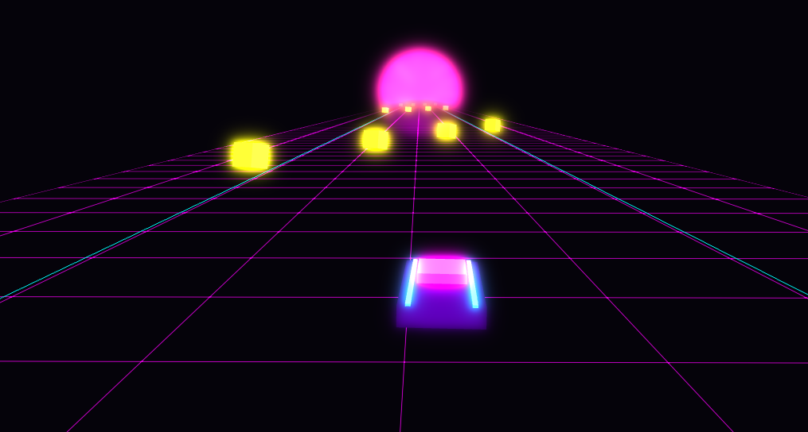
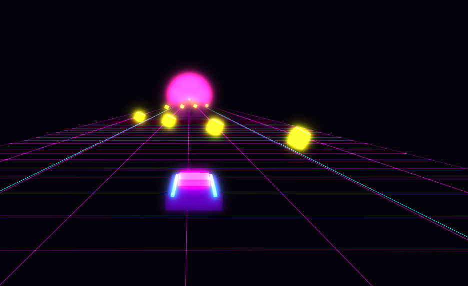

# 🏎️ Necky: Prize Run

A motion-controlled web game intended for entertainment purposes only.

**All head tracking runs locally in your browser — no video is ever recorded or sent to any server.** The game is also available for fully offline local play; see setup instructions below.

---
### 🌐 Play Online
If you'd rather not set it up locally, play the official hosted version at **https://cortexhatch-ux.github.io/Necky/**.
---




## 🚀 How to Play (Local Setup)

Since this game uses webcam tracking and local processing, follow these steps to run it on your machine:

### 1. Prerequisites
- Install [Node.js](https://nodejs.org/) (Recommended: LTS version).
- A computer with a webcam.

### 2. One-Time Setup
Clone this repository or download the ZIP, then open your terminal in the project folder and run these once:

```bash
# Install dependencies
npm install

# Download local MediaPipe models (MANDATORY for offline play)
npm run setup:offline
```

### 3. Every Time You Play
Simply start the local development server:

```bash
npm run dev
```
Once started, open [http://localhost:5173/Necky/](http://localhost:5173/Necky/) in your browser (Chrome or Edge recommended).

## 🕹️ Controls

Move your head in front of your webcam to navigate:
- **☝️ Chin Up:** Reach High prizes.
- **👇 Chin Down:** Reach Low prizes in valleys.
- **↩️ Look Left / ↪️ Look Right:** Follow curved prize trails and steer.

## 🛠️ Commands
- `npm run dev`: Start the game.
- `npm run stop`: Force-kill all background game processes (use this if you see "Port in use" errors).
- `npm run build`: Create a production-ready build in the `dist/` folder.

## ✍️ Behind the Project (Developer's Note)

As a developer, I've always struggled with neck stiffness from long hours at the desk. With the advent of AI and powerful computer vision, I thought: *"Why not turn basic neck exercises into a game?"*

This is nowhere near perfect—just a fun start. I hope you enjoy it!

## 💳 Commercial Use & Licensing

This project is licensed under a **Non-Commercial License**. 

- **Individuals:** Free to play, study, and modify for personal use.
- **Commercial Entities:** You may **NOT** use this software for any revenue-generating purpose (including subscription-based games, apps, or services) without explicit written permission from the author.

If you are interested in commercial licensing, please reach out to the author via GitHub.

## 🛡️ Official Source & Security Warning

**Please Read for Your Safety:**

- **Hosted Version:** The official version of this game is at **https://cortexhatch-ux.github.io/Necky/**.
- **Phishing Warning:** If you find any *other* website hosting this game, it is **unofficial and unauthorized**. We are not responsible for any security risks, phishing attacks, or data theft associated with such third-party sites.
- **Privacy:** Even when playing online at the authorized link, all head tracking is processed **locally** in your browser. No video data is ever sent to the server.
- **Local Play Always an Option:** If you're hesitant about the hosted version, setting up locally will give you maximum privacy.

## ⚖️ Legal Disclaimer & Limitation of Liability

**By using this software, you agree to the following:**

1. **Not Medical Advice:** Necky is an arcade game intended for entertainment purposes only. It does not provide medical advice, diagnosis, or treatment, and no health benefits are guaranteed.
2. **Assumption of Risk:** Neck movements involve inherent risks. You perform all movements at your own risk and discretion.
3. **No Liability:** To the maximum extent permitted by law, the developers and contributors of this software shall not be held liable for any injuries, pain, health complications, or damages arising from the use of this application.
4. **Consult a Professional:** Always consult with a qualified healthcare provider or physical therapist before starting any new exercise routine, especially if you have a history of neck or back pain.

**Stop playing immediately if you experience any pain, dizziness, numbness, or discomfort.**

**Intended for adults.** Parental supervision is advised for younger users.

---
**Privacy Note:** All head tracking is processed locally in your browser using MediaPipe. No video data is ever recorded or sent to any server.
